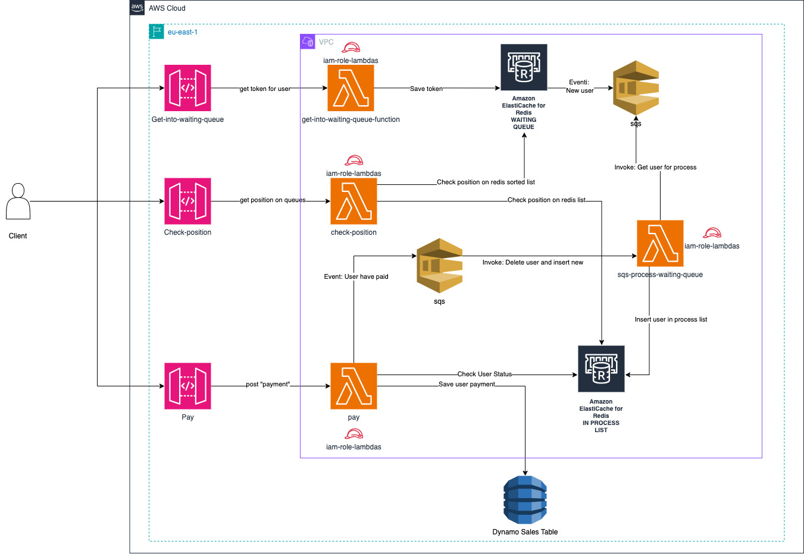

# ✨ ☁️ AWS Ticketear - UADE 📖 ✨
# ✍️ Proyecto para Universidad UADE

Este repositorio contiene un proyecto desarrollado para la Universidad UADE, materia arquitectura de aplicaciones. El objetivo del proyecto es utilizar los servicios de AWS para generar un MVP que utlice una arquitectura basada en eventos.

## 🎟️ App
Sistema de compra de tickets online. En simples palabras, una tiquetera.

## 🔥 Arquitectura

## Características
- **AWS SAM**: Infraestructura basada en codigo usando AWS SAM para el deploy y las pruebas.
- **AWS SQS**: Colas de mensajeria para arquitectura basada en eventos.
- **AWS Elasticache**: Base de datos de tipo Redis para manejo de colas de espera.
- **AWS Lambda**: Servicio serverless para procesamiento de datos.
- **AWS Apigateway**: Servicio para configuracion de endpoints e invocacion de lambdas.
- **AWS DynamoDB**: Base de datos no relacional para almacenar ventas.
- **AWS IAM**: Manejo de usuarios, roles y permisos para con los servicios dentro de AWS.
- **AWS VPC**: Cloud virtual privada para poder confiugrar las lambdas y tener acceso a recursos de AWS.
- **TypeScript**: Configuración inicial del proyecto con TypeScript.
- **LocalStack**: Configuración para servicios de AWS compatibles con LocalStack.
  - Facilidad para probar la infraestructura localmente utilizando LocalStack.

## :rocket:  Instrucciones de Uso
1. Clonar el repositorio a tu máquina local.
2. Install [AWS SAM CLI](https://docs.aws.amazon.com/serverless-application-model/latest/developerguide/serverless-sam-cli-install.html)
3. Instalar las dependencias necesarias utilizando `yarn` o tu gestor de dependencias favorito.
   1. Si usas otro como `npm`, recorda actualizar los scripts de `package.json`.
4. Iniciar LocalStack utilizando Docker, instalar con:
   
 - Comando (MAC): ` brew install localstack/tap/localstack-cli `.
 - Prerequisitos:
    - docker
    - docker-compose (version 1.9.0+)
  
  - Ejecutar el CLI instalado: `localstack start` o `docker-compose up`
  - Si no tenes configurado AWS anteriormente, podes hacerlo para esta ocacion usando:
    - `aws configure set aws_access_key_id test`
    - `aws configure set aws_secret_access_key test`
    - `aws configure set region us-east-1`
    Estos valores son placeholders, LocalStack no requiere credenciales de AWS reales

5. Deployar el stack de SAM: `samlocal deploy` (Ejecuta build y deploy) para dev o `yarn sam:deploy:prod` para prod.
6. Levantar las lambdas: `npm run sync`

## Levantar proyecto shortcut

Una vez todo instalado, como reminder de como levantar todo es el siguiente:
1. Terminal 1: `docker compose up`
2. Terminal 2: 
   1. `npm run deploy`
   2. `npm run sync`
3. Terminal 3: `npm run logs`

### Como utilizar localstack

Documentacion y guia sobre como levantar localstack si tienen mas dudas: https://medium.com/@ben.meehan_27368/how-to-setup-aws-locally-using-localstack-without-spending-a-buck-1c6e20bce8

## :information_source:  Contacto
Para cualquier pregunta o consulta sobre este proyecto, por favor contacta a equipo 5.